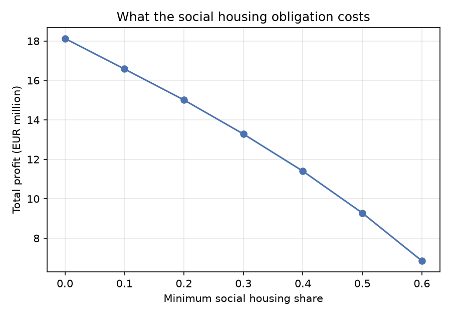

# Planning a mixed-tenure tower: what the social housing obligation costs


A mixed-integer programme that plans a 23-floor residential tower: how many floors of
each layout to build, who owns them, and which tenure sector each apartment goes to.
Profit is maximised subject to the planning obligations a municipality attaches to
permission — minimum shares for social and mid-market housing, minimum average sizes,
and ownership rules.

```bash
pip install -e ".[dev]"
python -m towerplan.report   # solves, sweeps the policy, writes reports/
pytest -q
```

## The answer, and the more useful answer

The optimal plan earns **EUR 11.40 million** across 170 apartments: 4 compact floors,
10 balanced, 9 spacious, none penthouse. Both regulated sectors land *exactly* on their
minimum share, which is the model telling you the obligation binds — one more social
apartment always displaces a free-sector one worth more.

The plan is the boring output. The interesting one is what the obligation costs:



| Minimum social share | Profit (EUR m) | Change vs 0% | Status |
| --- | --- | --- | --- |
| 0% | 18.13 | — | optimal |
| 20% | 15.01 | −3.12 | optimal |
| 40% | 11.40 | −6.73 | optimal |
| 60% | 6.85 | −11.28 | optimal |
| 70% | — | — | **infeasible** |

Roughly EUR 1.6 million of profit per 10 percentage points of social housing, and at 70%
the scheme cannot be built at all alongside the average-area and ownership rules. For a
negotiation between a developer and a municipality, that slope and that cliff are the
whole conversation — neither is visible from a single solve.

Full report: [`reports/plan.md`](reports/plan.md).

## The model

| | |
| --- | --- |
| Decisions | floors per layout, floors per owner, apartments per (sector, size, owner) |
| Objective | maximise development profit |
| Constraints | floors built, apartment balance, floor ownership, ownership consistency, sector minimum shares, sector average area, owner size limits, owner minimum share |
| Type | pure integer, solved with HiGHS via Pyomo |

The constraint that makes it one model rather than two is **ownership consistency**:
an owner's apartments of a given size must follow from the floors that owner actually
holds. Without it the solver hands the profitable apartments to one party while someone
else owns the floor they stand on.

## Tests

The suite checks the solution against the constraints independently of the solver —
floors sum to the tower height, apartments assigned match what the layouts produce,
minimum shares and average areas hold, forbidden owner-sector pairs stay empty. It also
checks two things about the model rather than one instance: tightening the social
obligation can never raise profit, and an impossible obligation comes back as
`infeasible` rather than as a plan.

## Limitations

- Profit per apartment is a parameter, not a function of the sales programme, financing
  cost or timing.
- One tower in isolation: no construction cost, phasing or planning risk.
- All parameters are invented. The structure is a case study, the numbers are not real.

## Provenance

Rebuilt from my final assignment for Advanced Analytics for a Better World (MSc Data
Science and Business Analytics, University of Amsterdam). The original read its
parameters from a course spreadsheet, which is not included here; this version
generates its own instance, and adds the policy sweep, the report and the tests.
